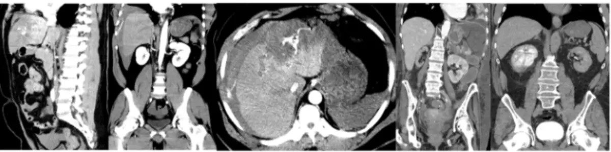
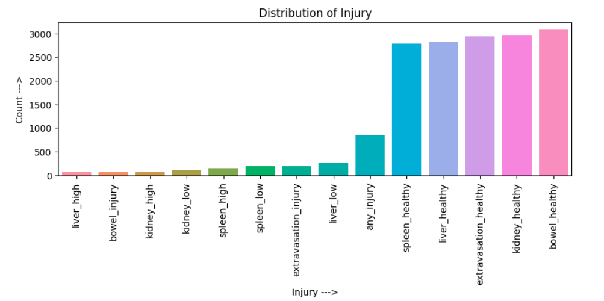
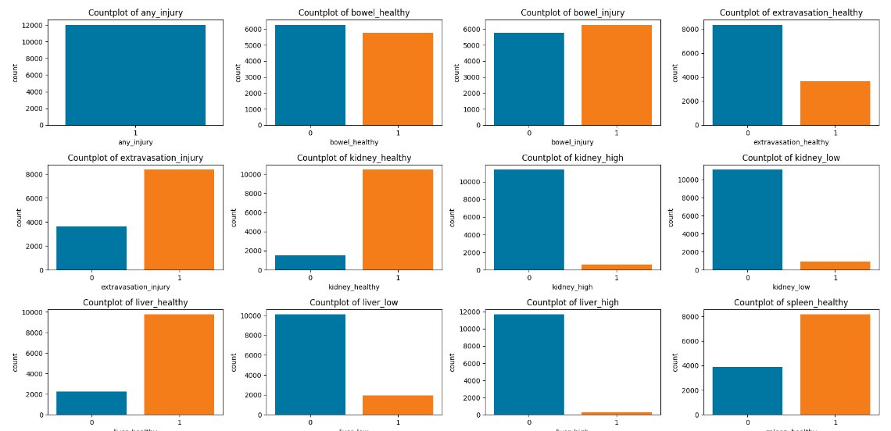
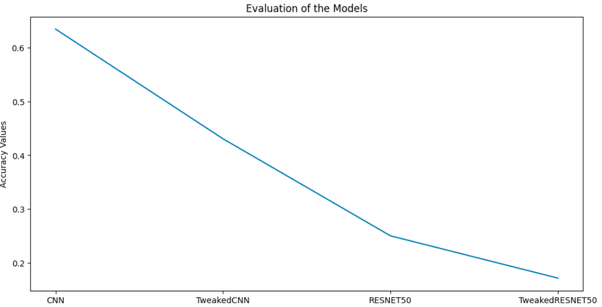

# Abdominal Trauma Detection
Author: Diana Nduta Mwaura

## Overview
Blunt force abdominal trauma is among the most common types of traumatic injury, with the most frequent cause being motor vehicle accidents. There are estimated to be more than 5 million annual deaths worldwide from traumatic injury. Abdominal trauma may result in damage and internal bleeding of the internal organs, including the liver, spleen, kidneys, and bowel. Detection and classification of injuries are key to effective treatment and favorable outcomes. A large proportion of patients with abdominal trauma require urgent surgery. Abdominal trauma often cannot be diagnosed clinically by physical exam, patient symptoms, or laboratory tests.Prompt diagnosis of abdominal trauma using medical imaging is thus critical to patient care.

## Business Problem
Computed tomography (CT) has become an indispensable tool in evaluating patients with suspected abdominal injuries due to its ability to provide detailed cross-sectional images of the abdomen. Interpreting CT scans for abdominal trauma, however, can be a complex and time-consuming task, especially when multiple injuries or areas of subtle active bleeding are present. This project aims at harnessing the power of machine learning to assist medical professionals in rapidly and precisely detecting injuries and grading their severity.

## Data 
The dataset was obtained from Kaggle competition RSNA 2023 Abdominal Trauma Detection. The competition is composed of different datasets that contain columns that aid in training the models. The train.csv dataset contains the labels of the various injuries. The image_level_labels.csv dataset is composed of the specific images that contain either the bowel or extravasation injury. The image paths dataset contains paths to the images in the google cloud storage. All the datasets did not have duplicates or missing values.

## Methods
CRISP-DM approach was used to structure the project implementation from data understanding, Exploratory Data Analysis, Modeling, Evaluation and Coclusion. The models were generated using the Convolutional Neural Network algorithm and the Transfer Learning Models algorithm.

## Results
From the dataset healthy organs had more values compared to injured organs. Bowel healthy was the highest and liver high(meaning a high severity of the injury) the lowest.

The distribution of the binary targets for each organ depending on whether the severity of the injury is high, low or the organ is healthy is as shown below.

The line graph below shows how the different models performed based on their training accuracies. The best performing model was the Convolutional Neural Network using the RMSprop optimizer. The test accuracy was also higher relative to other models.

## Conclusion